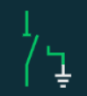

### 基础图形
每种图形导出为 
`
    (props: ShapeProps) => ShapeElement
`
类型定义见 model.d.ts

### 图形预览

#### bank

#### barrow

#### breaker 

#### coupledSwitch 

#### disconnector 

#### disconnectorWithEarth 

#### earth 

#### earthConnector 

#### fuse

#### loadSwitch

#### pcs

#### rank

#### winding

